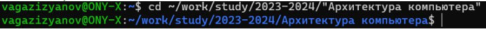

---
## Front matter
title: "ОТЧЕТ ПО ЛАБОРАТОРНОЙ РАБОТЕ № 2"
subtitle: "дисциплина: Архитектура компьютера"
author: "Газизянов Владислав Альбертович"

## Generic otions
lang: ru-RU
toc-title: "Содержание"

## Bibliography
bibliography: bib/cite.bib
csl: pandoc/csl/gost-r-7-0-5-2008-numeric.csl

## Pdf output format
toc: true # Table of contents
toc-depth: 2
lof: true # List of figures
fontsize: 12pt
linestretch: 1.5
papersize: a4
documentclass: scrreprt
## I18n polyglossia
polyglossia-lang:
  name: russian
  options:
	- spelling=modern
	- babelshorthands=true
polyglossia-otherlangs:
  name: english
## I18n babel
babel-lang: russian
babel-otherlangs: english
## Fonts
mainfont: PT Serif
romanfont: PT Serif
sansfont: PT Sans
monofont: PT Mono
mainfontoptions: Ligatures=TeX
romanfontoptions: Ligatures=TeX
sansfontoptions: Ligatures=TeX,Scale=MatchLowercase
monofontoptions: Scale=MatchLowercase,Scale=0.9
## Biblatex
biblatex: true
biblio-style: "gost-numeric"
biblatexoptions:
  - parentracker=true
  - backend=biber
  - hyperref=auto
  - language=auto
  - autolang=other*
  - citestyle=gost-numeric
## Pandoc-crossref LaTeX customization
figureTitle: "Рис."
tableTitle: "Таблица"
listingTitle: "Листинг"
lofTitle: "Список иллюстраций"
lotTitle: "Список таблиц"
lolTitle: "Листинги"
## Misc options
indent: true
header-includes:
  - \usepackage{indentfirst}
  - \usepackage{float} # keep figures where there are in the text
  - \floatplacement{figure}{H} # keep figures where there are in the text
---

# Цель работы
Изучить и понять принципы работы системы контроля
версий Git.
- Освоение основных команд Git, таких как init, add,
commit, push, pull, clone, branch, checkout и других.
- Понимание, как Git отслеживает изменения в файлах и
как он хранит эти изменения.
- Изучение ветвления и слияния в Git, а также способов
решения конфликтов при слиянии.
- Практическое применение Git для управления
версиями проекта, включая работу с удаленными
репозиториями.
В конечном итоге, целью является развитие навыков,
которые позволят эффективно использовать Git для управления
версиями кода.

# Задание
Задание данной работы является освоение идеологии и использование
инструментов контроля версий. Также получение практического опыта в
работе с системой git.

# Теоретическое введение
3.1. Системы контроля версий.
 Общие понятия
Системы контроля версий (Version Control System,
VCS) применяются при работе нескольких человек над одним
проектом. Обычно основное дерево проекта хранится в
локальном или удалённом репозитории, к которому настроен
доступ для участников проекта. При внесении изменений в
содержание проекта система контроля версий позволяет их
фиксировать, совмещать изменения, произведённые разными
участниками проекта, производить откат к любой более ранней
версии проекта, если это требуется. В классических системах
контроля версий используется централизованная модель,
предполагающая наличие единого репозитория для хранения
файлов. Выполнение большинства функций по управлению
версиями осуществляется специальным сервером. Участник
проекта (пользователь) перед началом работы посредством
определённых команд получает нужную ему версию файлов.
После внесения изменений, пользователь размещает новую
версию в хранилище. При этом предыдущие версии не
удаляются из центрального хранилища и к ним можно
вернуться в любой момент. Сервер может сохранять не полную
версию изменённых файлов, а производить так называемую
дельта-компрессию — сохранять только изменения между
последовательными версиями, что позволяет уменьшить объём
хранимых данных. Системы контроля версий поддерживают
возможность отслеживания и разрешения конфликтов, которые
могут возникнуть при работе нескольких человек над одним
файлом. Можно объединить (слить) изменения, сделанные
разными участниками (автоматически или вручную), вручную
выбрать нужную версию, отменить изменения вовсе или
заблокировать файлы для изменения. В зависимости от
настроек блокировка не позволяет другим пользователям
получить рабочую копию или препятствует изменению
рабочей копии файла средствами файловой системы ОС,
обеспечивая таким образом, привилегированный доступ только
одному пользователю, работающему с файлом.
Системы контроля версий также могут обеспечивать
дополнительные, более гибкие функциональные возможности.
Например, они могут поддерживать работу с несколькими
версиями одного файла, сохраняя общую историю изменений
до точки ветвления версий и собственные истории изменений
каждой ветви. Кроме того, обычно доступна информация о том,
кто из участников, когда и какие изменения вносил. Обычно
такого рода информация хранится в журнале изменений,
доступ к которому можно ограничить. В отличие от
классических, в распределённых системах контроля версий
центральный репозиторий не является обязательным. Среди
классических VCS наиболее известны CVS, Subversion, а среди
распределённых — Git, Bazaar, Mercurial. Принципы их работы
схожи, отличаются они в основном синтаксисом используемых
в работе команд.

3.2. Система контроля версий Git
Система контроля версий Git представляет собой набор
программ командной строки. Доступ к ним можно получить из
терминала посредством ввода команды git с различными
опциями. Благодаря тому, что Git является распределённой
системой контроля версий, резервную копию локального
хранилища можно сделать простым копированием или
архивацией
3.3. Основные команды git

{#fig:001 width=70%}

{#fig:001 width=70%}

# Выполнение лабораторной работы
4.1. Настройка GitHub
Создаём учётную запись на сайте https://github.com/ и
заполняем основные данные.(рис.1) 

{#fig:001 width=70%}

4.2 Базовая настройка git.
Начнем с базовой настройки git. Запустим терминал и
выполним следующие команды(

git config --global user.name ""
git config --global user.email ""

), указав имя и электронную почту владельца
репозитория(рис.2) 

{#fig:001 width=70%}

Настроим utf-8 в выводе сообщений git: (Рис.3) 

{#fig:001 width=70%}

Зададим имя начальной ветки (будем называть её
master):
(Рис.4) 

{#fig:001 width=70%}

Параметр autocrlf: (рис.5) 

{#fig:001 width=70%}

Параметр safecrlf: (Рис.6) 

{#fig:001 width=70%}

4.3. Создание SSH ключа
генерируем пару ключей (приватный и открытый):
9
(Рис.7) 

{#fig:001 width=70%}

Смотрим сгенерированный публичный ключ командой
cat ~/.ssh/id_rsa.pub (Рис.8) 

[Публичный ключ](image/photo_5282741463081407679_x.jpg){#fig:001 width=70%}

Скопировав из локальной консоли ключ в буфер обмена
вставляем ключ в появившееся на сайте поле и указываем для
ключа имя (Title).(Рис.9) 

{#fig:001 width=70%}

4.4. Создание рабочего пространства и
репозитория курса на основе шаблона
Открываем терминал и создаём каталог для предмета
«Архитектура компьютера»: (рис 10) 
10

{#fig:001 width=70%}

4.5. Сознание репозитория курса на основе
шаблона
Создаём новый репозиторий. (Рис 11) 

{#fig:001 width=70%}

Открываем терминал и переходим в каталог курса. (Рис
12) 

{#fig:001 width=70%}

Клонируем созданный репозиторий. (рис 13) 

{#fig:001 width=70%}

4.6. Настройка каталога курса
Переходим в каталог курса и удаляем лишние файлы.
(Рис 14) 

{#fig:001 width=70%}

Создаём необходимые каталоги.(Рис.15) 

{#fig:001 width=70%}

Отправляем файлы на сервер.(Рис.16) 

{#fig:001 width=70%}

Проверяем правлиьность(Рис.17) 

{#fig:001 width=70%}
5.Самостаятельная работа
Создаём нужный каталог.(Рис.18) 

{#fig:001 width=70%}

Скопируем отчеты по выполнению предыдущих
лабораторных работ в соответствующие каталоги
созданногорабочего пространства. (Рис.19,
20) 

{#fig:001 width=70%}

{#fig:001 width=70%}

Загружаем файлы на
github(Рис.21) 

{#fig:001 width=70%}

# Выводы
1. Освоены основные команды Git, что позволяет
уверенно использовать систему контроля версий.
2. Понято, как Git отслеживает изменения в файлах, а
также как он хранит и отображает эти изменения.
3. Изучены принципы ветвления и слияния, а также
способы решения конфликтов, возникающих при слиянии
веток.
4. На практике применен Git для управления проектом,
в том числе для работы с удаленными репозитариями.
5. Развиты навыки, необходимые для эффективного
использования Git для управления версиями кода, что
позволяет улучшить качество работы и снизить возможные
ошибки.
