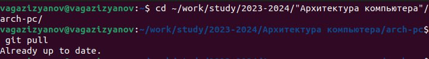
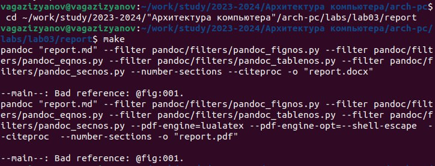
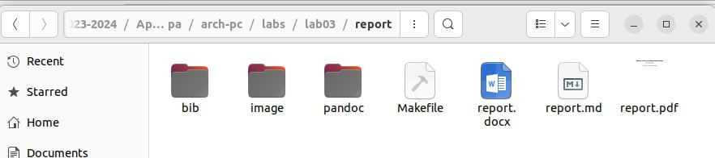
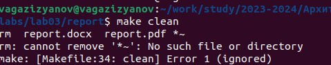
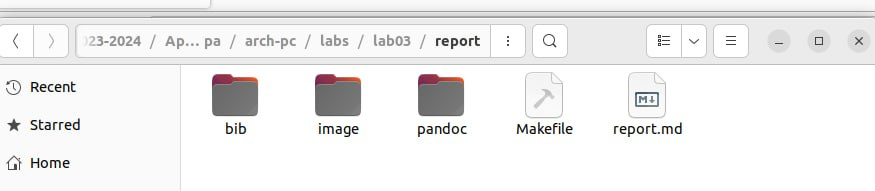
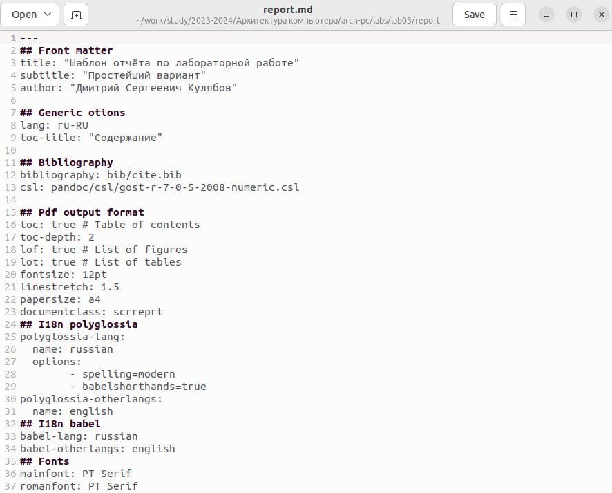
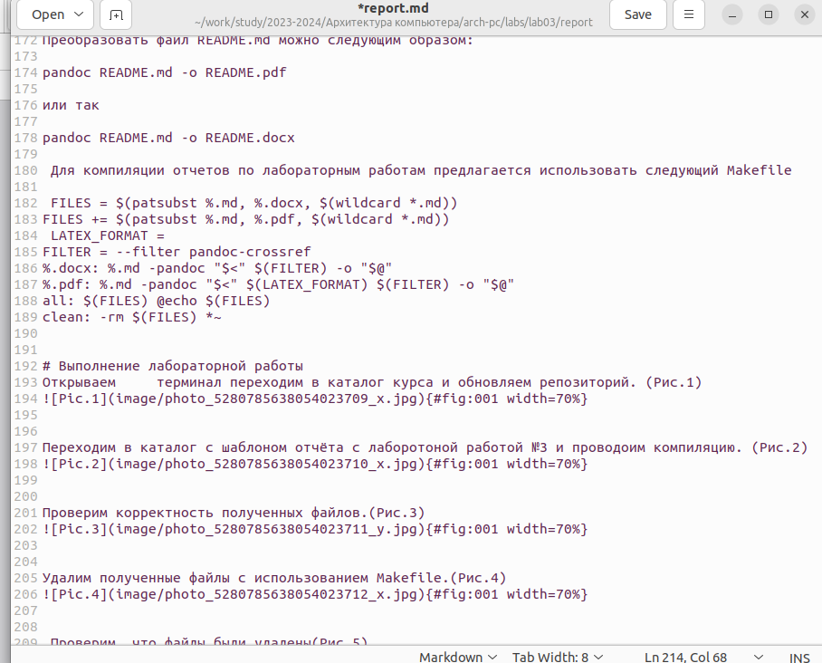
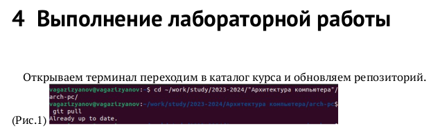

---
## Front matter
title: "ОТЧЕТ ПО ЛАБОРАТОРНОЙ РАБОТЕ № 3"
subtitle: "дисциплина:	Архитектура компьютера"
author: "Газизянов Владислав Альбертович"

## Generic otions
lang: ru-RU
toc-title: "Содержание"

## Bibliography
bibliography: bib/cite.bib
csl: pandoc/csl/gost-r-7-0-5-2008-numeric.csl

## Pdf output format
toc: true # Table of contents
toc-depth: 2
lof: true # List of figures
fontsize: 12pt
linestretch: 1.5
papersize: a4
documentclass: scrreprt
## I18n polyglossia
polyglossia-lang:
  name: russian
  options:
	- spelling=modern
	- babelshorthands=true
polyglossia-otherlangs:
  name: english
## I18n babel
babel-lang: russian
babel-otherlangs: english
## Fonts
mainfont: PT Serif
romanfont: PT Serif
sansfont: PT Sans
monofont: PT Mono
mainfontoptions: Ligatures=TeX
romanfontoptions: Ligatures=TeX
sansfontoptions: Ligatures=TeX,Scale=MatchLowercase
monofontoptions: Scale=MatchLowercase,Scale=0.9
## Biblatex
biblatex: true
biblio-style: "gost-numeric"
biblatexoptions:
  - parentracker=true
  - backend=biber
  - hyperref=auto
  - language=auto
  - autolang=other*
  - citestyle=gost-numeric
## Pandoc-crossref LaTeX customization
figureTitle: "Рис."
tableTitle: "Таблица"
listingTitle: "Листинг"
lolTitle: "Листинги"
## Misc options
indent: true
header-includes:
  - \usepackage{indentfirst}
  - \usepackage{float} # keep figures where there are in the text
  - \floatplacement{figure}{H} # keep figures where there are in the text
---

# Цель работы
Изучить основные принципы и синтаксис языка разметки Markdown. Научиться использовать Markdown для создания и оформления текстовых документов различного назначения. Ознакомиться с различными реализациями и диалектами Markdown, а также с инструментами для работы с ним. Сравнить преимущества и недостатки Markdown по сравнению с другими языками разметки, такими как HTML, XML, TeX и т.д. Продемонстрировать полученные знания и навыки на практических примерах.


# Задание
Освоение процедуры оформления отчетов с помощью легковесного языка разметки Markdown.


# Теоретическое введение
Базовые сведения о Markdown
Чтобы создать заголовок, используйте знак #, например,

 # This is heading 1 
## This is heading 2 
### This is heading 3
 #### This is heading 4 

Чтобы задать для текста полужирное начертание, заключите его в двойные звездочки: 

This text is **bold**. 

Чтобы задать для текста курсивное начертание, заключите его в одинарные звездочки:
 
This text is *italic*.

Чтобы задать для текста полужирное и курсивное начертание, заключите его в тройные звездочки:

This is text is both ***bold and italic***. <hr>

Блоки цитирования создаются с помощью символа >: 
> The drought had lasted now for ten million years, and the reign of the
  terrible lizards had long since ended. Here on the Equator, in the 
 continent which would one day be known as Africa, the battle for existence 
 had reached a new climax of ferocity, and the victor was not yet in sight.
  In this barren and desiccated land, only the small or the swift or the 
 fierce could flourish, or even hope to survive. 

Упорядоченный список можно отформатировать с помощью соответствующих цифр:
1.		First instruction 
	1.		Sub-instruction 
	1.		Sub-instruction 
1. 		Second instruction

Чтобы вложить один список в другой, добавьте отступ для элементов дочернего списка: 
1.	First instruction 
1. 	Second instruction 
1. 	Third instruction 

Неупорядоченный (маркированный) список можно отформатировать с помощью звездочек или тире: 
* List item 1 
* List item 2 
* List item 3

Чтобы вложить один список в другой, добавьте отступ для элементов дочернего списка:
 - List item 1 
- List item A 
- List item B
 - List item 2 
Синтаксис Markdown для встроенной ссылки состоит из части [link text], представляющей текст гиперссылки, и части (file-name.md) – URL-адреса или имени файла, на который дается ссылка: 

[link text](file-name.md)
или 

[link text](http://example.com/ "Необязательная подсказка")

Markdown поддерживает как встраивание фрагментов кода в предложение, так и их размещение между предложениями в виде отдельных огражденных блоков. Огражденные блоки кода — это простой способ выделить синтаксис для фрагментов кода. Общий формат огражденных блоков кода: 

``` language 
your code goes in here
 ```

3.2 Оформление формул в Markdown
Внутритекстовые формулы делаются аналогично формулам LaTeX. Например, формула sin2 (𝑥) + cos2 (𝑥) = 1 запишется как 

$\sin^2 (x) + \cos^2 (x) = 1$

Выключение формулы: 

sin2 (𝑥) + cos2 (𝑥) = 1 

(3.1) со ссылкой в тексте «Смотри формулу ({-eq. 3.1}).» записывается как 

$$ 
\sin^2 (x) + \cos^2 (x) = 1 
$$ {#eq:eq1} 

Смотри формулу (`[-@eq:eq1]`)
3.1Оформление изображений в Markdown
В Markdown вставить изображение в документ можно с помощью непосредственного указания адреса изображения. Синтаксис данной команды выглядит следующим образом:

[Comment]: < { #fig:fig1 width=70% } > 

Здесь: 
 в квадратных скобках указывается подпись к изображению;
  в круглых скобках указывается URL-адрес или относительный путь изображения, а также (необязательно) всплывающую подсказку, заключённую в двойные или одиночные кавычки.
 в фигурных скобках указывается идентификатор изображения (#fig:fig1) для ссылки на него по тексту и размер изображения относительно ширины страницы (width=90%) 

[Comment]: < Ссылка на изображение (рис. 3.1) может быть оформлена следующим образом (рис. [- @fig:fig1]) >
3.2Обработка файлов в формате Markdown
Преобразовать файл README.md можно следующим образом: 

pandoc README.md -o README.pdf

или так

pandoc README.md -o README.docx

 Для компиляции отчетов по лабораторным работам предлагается использовать следующий Makefile

 FILES = $(patsubst %.md, %.docx, $(wildcard *.md)) 
FILES += $(patsubst %.md, %.pdf, $(wildcard *.md))
 LATEX_FORMAT = 
FILTER = --filter pandoc-crossref 
%.docx: %.md -pandoc "$<" $(FILTER) -o "$@" 
%.pdf: %.md -pandoc "$<" $(LATEX_FORMAT) $(FILTER) -o "$@" 
all: $(FILES) @echo $(FILES) 
clean: -rm $(FILES) *~


# Выполнение лабораторной работы
Открываем     терминал переходим в каталог курса и обновляем репозиторий. (Рис.1) <br>
<p align="center">{#fig:001 width=70%}</p>


Переходим в каталог с шаблоном отчёта с лаборотоной работой №3 и проводоим компиляцию. (Рис.2)<br>
<p align="center">{#fig:001 width=70%}</p>


Проверим корректность полученных файлов.(Рис.3) <br>
<p align="center">{#fig:001 width=70%}</p>


Удалим полученные файлы с использованием Makefile.(Рис.4)<br>
<p align="center">{#fig:001 width=70%}</p>


Проверим, что файлы были удалены(Рис.5)<br>
<p align="center">{#fig:001 width=70%}</p>


Открываем файл report.md c помощью любого текстового редактора, например gedit(Рис.6) <br>
<p align="center">{#fig:001 width=70%}</p>


Внимательно изучаем структуру этого файла. Заполним отчет и скомпилируем отчет с использованием Makefile. (изучаем структуру, Заполним отчет и скомпилируем отчет)<br>
<p align="center">{#fig:001 width=70%}</p>
<br>Проверим корректность полученных файлов. (Рис.8)<br>
<p align="center">{#fig:001 width=70%}</p>

# Выводы
Язык разметки Markdown является мощным инструментом для создания отформатированных текстовых документов. Он прост в использовании, легко читается и пишется, и может быть преобразован во множество форматов, включая HTML, PDF и др. Markdown особенно полезен для написания технической документации, создания заметок, блогов и комментариев на форумах. Он также широко используется в системах контроля версий, таких как GitHub. В целом, освоение Markdown может значительно упростить процесс оформления текстовых документов и улучшить вашу продуктивность.


