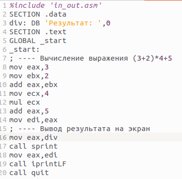

---
## Front matter
title: "Отчёта по лабораторной работе №9"
subtitle: "Понятие подпрограммы. Отладчик GDB."
author: "Газизянов Владислав Альбертович"

## Generic otions
lang: ru-RU
toc-title: "Содержание"

## Bibliography
bibliography: bib/cite.bib
csl: pandoc/csl/gost-r-7-0-5-2008-numeric.csl

## Pdf output format
toc: true # Table of contents
toc-depth: 2
lof: true # List of figures
fontsize: 12pt
linestretch: 1.5
papersize: a4
documentclass: scrreprt
## I18n polyglossia
polyglossia-lang:
  name: russian
  options:
	- spelling=modern
	- babelshorthands=true
polyglossia-otherlangs:
  name: english
## I18n babel
babel-lang: russian
babel-otherlangs: english
## Fonts
mainfont: PT Serif
romanfont: PT Serif
sansfont: PT Sans
monofont: PT Mono
mainfontoptions: Ligatures=TeX
romanfontoptions: Ligatures=TeX
sansfontoptions: Ligatures=TeX,Scale=MatchLowercase
monofontoptions: Scale=MatchLowercase,Scale=0.9
## Biblatex
biblatex: true
biblio-style: "gost-numeric"
biblatexoptions:
  - parentracker=true
  - backend=biber
  - hyperref=auto
  - language=auto
  - autolang=other*
  - citestyle=gost-numeric
## Pandoc-crossref LaTeX customization
figureTitle: "Рис."
tableTitle: "Таблица"
listingTitle: "Листинг"
lofTitle: "Список иллюстраций"
lolTitle: "Листинги"
## Misc options
indent: true
header-includes:
  - \usepackage{indentfirst}
  - \usepackage{float} # keep figures where there are in the text
  - \floatplacement{figure}{H} # keep figures where there are in the text
---

# Цель работы

Познакомиться с методами отладки при помощи GDB, его возможностями.

# Выполнение лабораторной работы

## Реализация подпрограмм в NASM
Создайте каталог для выполнения лабораторной работы № 9, перейдите в него и создайте файл lab09-1.asm:

{#fig:001 width=70%}

В качестве примера рассмотрим программу вычисления арифметического выражения f(x) = 2x + 7 с помощью подпрограммы _calcul. В данном примере x вводится с клавиатуры, а само выражение вычисляется в подпрограмме. Внимательно изучите текст программы (Листинг 9.1).
Введите в файл lab09-1.asm текст программы из листинга 9.1. Создайте исполняемый файл и проверьте его работу.

{#fig:001 width=70%}

{#fig:001 width=70%}

Измените текст программы, добавив подпрограмму _subcalcul в подпрограмму _calcul, для вычисления выражения f(g(x)), где x вводится с клавиатуры, f(x) = 2x + 7, g(x) = 3x − 1.

{#fig:001 width=70%}

Выодим результат.

{#fig:001 width=70%}

## Отладка программам с помощью GDB

Создайте файл lab09-2.asm с текстом программы из Листинга 9.2.

{#fig:001 width=70%}

{#fig:001 width=70%}

Для работы с GDB в исполняемый файл необходимо добавить отладочную информацию, для этого трансляцию программ необходимо проводить с ключом ‘-g’.

{#fig:001 width=70%}

Загрузите исполняемый файл в отладчик gdb

{#fig:001 width=70%}

Проверьте работу программы, запустив ее в оболочке GDB с помощью команды run

{#fig:001 width=70%}

Для более подробного анализа программы установите брейкпоинт на метку _start, с которой начинается выполнение любой ассемблерной программы, и запустите её.

{#fig:001 width=70%}

{#fig:001 width=70%}

Посмотрите дисассимилированный код программы с помощью команды disassemble начиная с метки _start

{#fig:001 width=70%}

Переключитесь на отображение команд с Intel’овским синтаксисом, введя команду set disassembly-flavor intel

{#fig:001 width=70%}

{#fig:001 width=70%}

Различия отображения синтаксиса машинных команд в режимах ATT и Intel:

1.Порядок операндов: В ATT синтаксисе порядок операндов обратный, сначала указывается исходный операнд, а затем - результирующий операнд. В Intel синтаксисе порядок обычно прямой, результирующий операнд указывается первым, а исходный - вторым.

2.Разделители: В ATT синтаксисе разделители операндов - запятые. В Intel синтаксисе разделители могут быть запятые или косые черты (/).

3.Префиксы размера операндов: В ATT синтаксисе размер операнда указывается перед операндом с использованием префиксов, таких как "b" (byte), "w" (word), "l" (long) и "q" (quadword). В Intel синтаксисе размер операнда указывается после операнда с использованием суффиксов, таких как "b", "w", "d" и "q".

4.Знак операндов: В ATT синтаксисе операнды с позитивными значениями предваряются символом "$". В Intel синтаксисе операнды с позитивными значениями могут быть указаны без символа "$".

5.Обозначение адресов: В ATT синтаксисе адреса указываются в круглых скобках. В Intel синтаксисе адреса указываются без скобок.

6.Обозначение регистров: В ATT синтаксисе обозначение регистра начинается с символа "%". В Intel синтаксисе обозначение регистра может начинаться с символа "R" или "E" (например, "%eax" или "RAX").

Включите режим псевдографики для более удобного анализа программы

{#fig:001 width=70%}

## Добавление точек останова

Проверяем точки останова с помощью команды info breakpoints

{#fig:001 width=70%}

Установим еще одну точку останова по адресу инструкции

{#fig:001 width=70%}

Посмотрите информацию о всех установленных точках останова

{#fig:001 width=70%}

## Работа с данными программы в GDB

Выполните 5 инструкций с помощью команды stepi (или si) и проследите за изменением значений регистров.

{#fig:001 width=70%}

Во время выполнения команд менялись регистры: ebx, ecx, edx,eax, eip.

Посмотреть содержимое регистров также можно с помощью команды info registers

{#fig:001 width=70%}

Посмотрите значение переменной msg1 по имени

{#fig:001 width=70%}

Посмотрите значение переменной msg2 по адресу

{#fig:001 width=70%}

Измените первый символ переменной msg1

{#fig:001 width=70%}

Замените любой символ во второй переменной msg2

{#fig:001 width=70%}

Выведете в различных форматах значение регистра edx.

{#fig:001 width=70%}

{#fig:001 width=70%}

Выводится разные значения, так как команда без кавычек присваивает регистру вводимое значение.

Завершите выполнение программы с помощью команды continue

{#fig:001 width=70%}

## Обработка аргументов командной строки в GDB

Создаём файл.

{#fig:001 width=70%}

Скопируйте файл lab8-2.asm, созданный при выполнении лабораторной работы №8, с программой выводящей на экран аргументы командной строки (Листинг 8.2) в файл с именем lab09-3.asm

{#fig:001 width=70%}

Создайте исполняемый файл

{#fig:001 width=70%}

Загрузите исполняемый файл в отладчик, указав аргументы:

{#fig:001 width=70%}

установим точку останова перед первой инструкцией в программе и запустим ее.

{#fig:001 width=70%}

Посмотрите остальные позиции стека

{#fig:001 width=70%}

{#fig:001 width=70%}

Шаг изменения адреса равен 4 потому что адресные регистры имеют размерность 32 бита(4 байта).

## Задание для самостоятельной работы

### Задание 1
Копируем файл lab8-4.asm(ср №1 в ЛБ8) в файл с именем lab09-4.asm

{#fig:001 width=70%}

Открываем файл и меняем его, создавая подпрограмму

{#fig:001 width=70%}

Создаем исполняемый файл и запускаем его

{#fig:001 width=70%}

### Задание 2
Создаём файл и всталвяем текст из листинг 9.3

{#fig:001 width=70%}

Создаем исполняемый файл и запускаем его

{#fig:001 width=70%}

Создаем исполняемый файл и запускаем его в отладчике GDB и смотрим на изменение регистров командой si

{#fig:001 width=70%}

Изменяем программу для корректной работы

{#fig:001 width=70%}

Создаем исполняемый файл и запускаем его

{#fig:001 width=70%}

# Выводы
Мы познакомились с методами отладки при помощи GDB и его возможностями.

