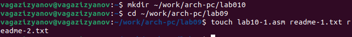
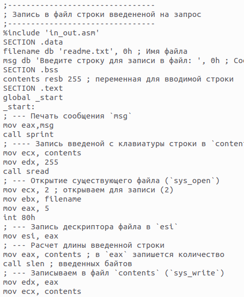
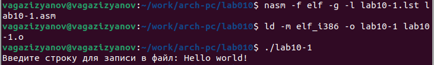
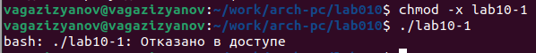
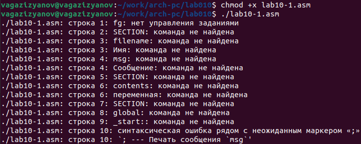
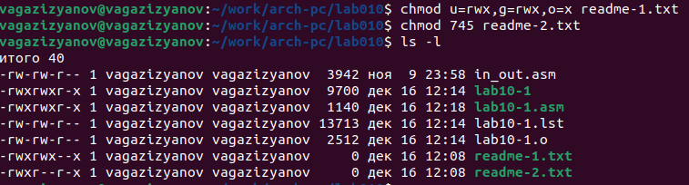
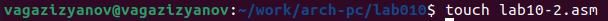
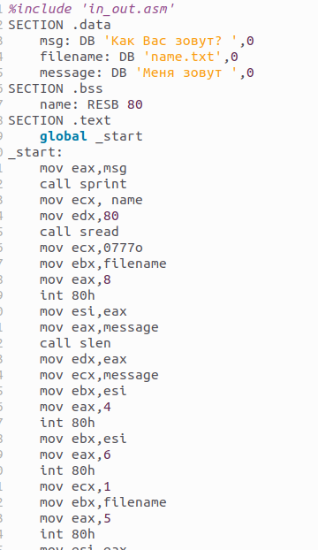
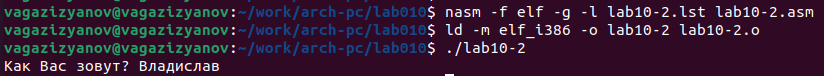

---
## Front matter
title: "Отчёта по лабораторной работе №10"
subtitle: "абота с файлами средствами Nasm"
author: "Газизянов Владислав Альбертович"

## Generic otions
lang: ru-RU
toc-title: "Содержание"

## Bibliography
bibliography: bib/cite.bib
csl: pandoc/csl/gost-r-7-0-5-2008-numeric.csl

## Pdf output format
toc: true # Table of contents
toc-depth: 2
lof: true # List of figures
fontsize: 12pt
linestretch: 1.5
papersize: a4
documentclass: scrreprt
## I18n polyglossia
polyglossia-lang:
  name: russian
  options:
	- spelling=modern
	- babelshorthands=true
polyglossia-otherlangs:
  name: english
## I18n babel
babel-lang: russian
babel-otherlangs: english
## Fonts
mainfont: PT Serif
romanfont: PT Serif
sansfont: PT Sans
monofont: PT Mono
mainfontoptions: Ligatures=TeX
romanfontoptions: Ligatures=TeX
sansfontoptions: Ligatures=TeX,Scale=MatchLowercase
monofontoptions: Scale=MatchLowercase,Scale=0.9
## Biblatex
biblatex: true
biblio-style: "gost-numeric"
biblatexoptions:
  - parentracker=true
  - backend=biber
  - hyperref=auto
  - language=auto
  - autolang=other*
  - citestyle=gost-numeric
## Pandoc-crossref LaTeX customization
figureTitle: "Рис."
tableTitle: "Таблица"
listingTitle: "Листинг"
lofTitle: "Список иллюстраций"
lolTitle: "Листинги"
## Misc options
indent: true
header-includes:
  - \usepackage{indentfirst}
  - \usepackage{float} # keep figures where there are in the text
  - \floatplacement{figure}{H} # keep figures where there are in the text
---

# Цель работы

Приобрести навыки написания программ для работы с файлам, научиться управлять доступом к файлам.

# Выполнение лабораторной работы
Создаем каталог для программ ЛБ10, и в нем создаем файлы

{#fig:001 width=70%}

Заполняем его в соответствии с листингом 10.1

{#fig:001 width=70%}

Создаем исполняемый файл и запускаем его

{#fig:001 width=70%}

Изменяем права доступа к файлу, запретив его выполнение. Пробуем запустить файл

{#fig:001 width=70%}

Выдало: отказано в доступе. Значит мы поставили правильный запрет на выполнение.
Изменяем права доступа к файлу с исходным текстом программы, добавив права на исполнение. Пробуем запустить файл

{#fig:001 width=70%}

lab10-1.asm является файлом с исходным кодом программы на языке ассемблера, искусственно добавление права на исполнение не даст ожидаемого результата. Такие файлы нужно компилировать или ассемблировать в машинный код, а затем выполнять.

ВАРИАНТ 2
Предоставляем права доступа к 2ум файлам, согласно варианту 2 в символьном и двоичном виде, затем проверяем работу команд.

{#fig:001 width=70%}

## Самостоятельная работа
Создаем новый файл

{#fig:001 width=70%}

Пишем программу, которая выполнит представленный список действий

{#fig:001 width=70%}

Создаем исполняевый файл и запускаем его, после этого проверяем создался ли новый файл, затем смотрим, как он заполнен

{#fig:001 width=70%}

# Выводы
Мы научились писать программы для работы с файлам и научились предоставлять права доступа к файлам.

